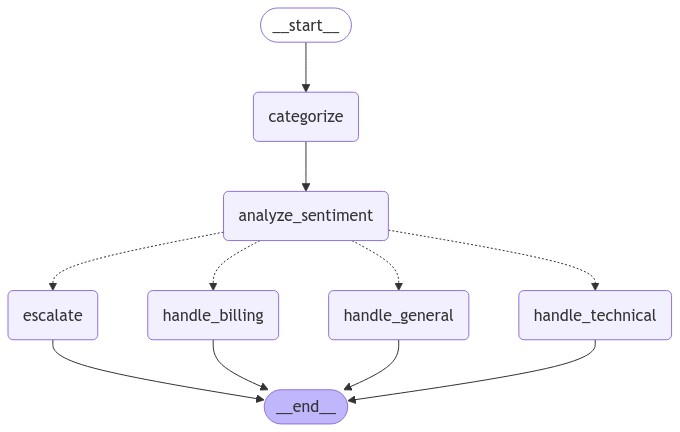

# 🧑‍💻 Intelligent Customer Support Agent with LangGraph 🤖

## 📚 Project Overview

This repository presents an intelligent customer support agent powered by LangGraph—a robust tool designed for building intricate workflows with language models. The agent is programmed to classify customer queries, evaluate sentiment, and deliver suitable responses or escalate inquiries when necessary. In this version, the agent leverages the **browser-use** library to consult online resources and uses a Gradio interface for testing.

## 💡 Purpose

Efficient and accurate customer support is essential in today’s competitive business landscape. By automating initial customer interactions, response times can be significantly shortened, thereby enhancing customer satisfaction. This project demonstrates how advanced language models combined with a graph-based workflow can be used to create an effective and scalable support system capable of handling diverse customer concerns.

## 🛠 Core Components

- **State Management:** Utilizes `TypedDict` to track and manage the state of each customer interaction.
- **Query Categorization:** Classifies queries into categories such as Technical, Billing, or General.
- **Sentiment Analysis:** Assesses the emotional tone of customer queries.
- **Response Generation:** Constructs responses based on query category and sentiment.
- **Escalation Protocol:** Automatically escalates queries with negative sentiment to a human agent.
- **Browser-Based Assistance:** Employs the **browser-use** library to consult online sources for informed, up-to-date responses.
- **Workflow Graph:** Leverages LangGraph to build an adaptable and extendable workflow.

## 📝 How It Works

1. **Setup:** Install the necessary libraries and prepare the Python environment.
2. **State Design:** Create a structure to store query data (category, sentiment, response).
3. **Node Functions:** Define functions for categorization, sentiment analysis, and generating responses.
4. **Graph Design:** Use `StateGraph` to establish the workflow, incorporating nodes and edges for the complete support process.
5. **Routing Logic:** Conditionally route the query based on its category and sentiment.
6. **Graph Compilation:** Compile the workflow into an executable application.
7. **Execution:** Process customer queries through the workflow and present results via the Gradio UI.

## 📊 Workflow Diagram

The following diagram illustrates the workflow of the customer support agent—from query categorization and sentiment analysis to routing and escalation:



## 📊 Browser Use


## ✅ Project Summary

This project showcases the versatility and power of LangGraph in creating AI-driven workflows. By merging natural language processing with graph-based techniques and augmenting capabilities with browser-based data fetching, we’ve built a customer support agent capable of efficiently addressing a wide range of queries. The system is easily extendable and can be integrated into existing support pipelines or databases.

---

## 🚀 Getting Started

Follow these steps to set up the project and run the customer support agent application.

### 1. Clone the Repository

Clone this repository to your local machine:

```bash
git clone https://github.com/alphatechlogics/LangGraphAgent.git
cd LangGraphAgent
```

### 2. Create a Virtual Environment

We recommend using uv to set up your Python environment:

```bash
uv venv --python 3.11
source .venv/bin/activate
```

Note: The prompt should now show your virtual environment (e.g., (LangGraphAgent)).

### 3. Activate the Virtual Environment

```bash
source venv/bin/activate
```

### 4. Install Required Dependencies

Install the necessary packages. We use uv pip to ensure packages are installed within the virtual environment:

```bash
uv pip install langgraph langchain_openai gradio
uv pip install browser-use
playwright install
```

### 5. Set Up Your OpenAI API Key

Create a .env file in the project root directory and add your OpenAI API key. This is required to interact with the OpenAI models:

```makefile
OPENAI_API_KEY=your_openai_api_key_here
```

### 6. Run the Application

After installing the dependencies and setting up the .env file, you can run the application:

```bash
python customer_support_gradio.py
```

### 7. Access the App

Once the app is running, open your browser and navigate to the URL shown in the terminal (typically `http://127.0.0.1:7860`) to interact with the customer support agent.
